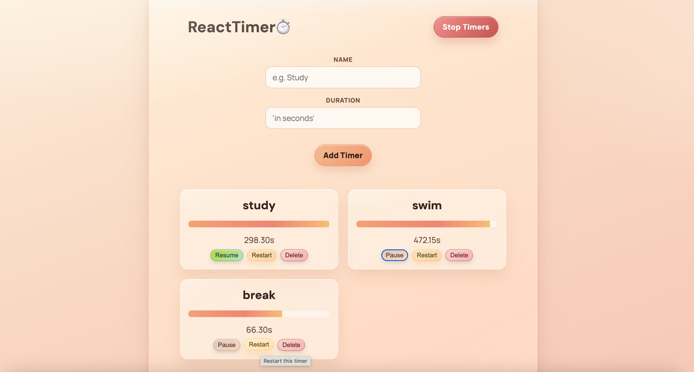

# ⏱ React Multi Timer

A React + TypeScript multi-timer app.  
You can create multiple timers, start/stop all at once, pause or resume individual timers, restart them, and delete them.

---

## 🚀 Features

- ➕ Add timers with a name and duration (in seconds)
- ▶️ Global **Start / Stop** for all timers
- ⏸ Per-timer **Pause / Resume**
- 🔁 Per-timer **Restart**
- 🗑 Delete timers
- 📊 Progress bar + formatted remaining time
- ⚠ Validation for empty name / invalid duration
- 🧠 Shared state via React Context + custom hook
- 🎨 Custom “glassmorphism” UI with gradient background

---

## 📸 Screenshots

### 🧮 Main Timer View


### ⏹ Stopping All Timers


### 📝 Adding a Timer


---

## 🧰 Tech Stack

| Category | Tech |
|----------|------|
| UI       | React 18 + TypeScript |
| State    | React Context + custom hook (`useTimersContext`) |
| Build    | Vite |
| Styling  | Custom CSS (gradient + glassmorphism) |
| Language | TypeScript |

---

## 📂 Project Structure

```txt
src/
├── components/
│   ├── AddTimer.tsx
│   ├── Header.tsx
│   ├── Timer.tsx
│   ├── Timers.tsx
│   └── UI/
│       ├── Button.tsx
│       ├── Container.tsx
│       └── Form.tsx / Input.tsx
├── store/
│   └── timers-context.tsx
├── App.tsx
├── main.tsx
└── index.css

## 🛠 Run locally

npm install
npm run dev


